# AstanaITUniversity_se2328 ERC-20 Token

This repository contains an ERC-20 token project named **AstanaITUniversity_se2328**, created as part of the Blockchain Technologies Assignment 3, Part 1. The project demonstrates:

- Creating a custom ERC-20 token with 2000 tokens as an initial supply.  
- Storing transaction details (sender, receiver, amount, timestamp) in the contract.  
- Retrieving transaction data via dedicated functions.  
- Returning a timestamp in a human-readable string format.  
- Deploying the token on a test network (Holesky) using MetaMask and Hardhat.  

**University:** Astana IT University  
**Group:** se-2328  

---

## Table of Contents

1. [Project Requirements](#project-requirements)  
2. [Prerequisites](#prerequisites)  
3. [Installation](#installation)  
4. [Project Structure](#project-structure)  
5. [Configuration](#configuration)  
6. [Compilation](#compilation)  
7. [Deployment](#deployment)  
8. [Usage](#usage)  
    - [Adding Token to MetaMask](#adding-token-to-metamask)  
    - [Transferring Tokens](#transferring-tokens)  
    - [Querying Contract Functions](#querying-contract-functions)  
9. [Screenshots / Demo](#screenshots--demo)  
10. [License](#license)  

---

## Project Requirements

1. **ERC-20 Token** named **AstanaITUniversity_se2328**.  
2. **Initial Supply:** 2000 tokens.  
3. **Transaction Information Functions:**  
   - Retrieve sender, receiver, amount, timestamp for a given transaction hash.  
   - Provide a human-readable string for the latest transaction’s timestamp.  
4. **Deploy using MetaMask** on any testnet (Holesky in this project) via Hardhat.  
5. **Documentation & GitHub Repo:** Must include:  
   - Source Code  
   - `README.md` with usage, screenshots, etc.  
   - `LICENSE`  

---

## Prerequisites

- **Node.js** (v16 or above)  
- **npm** or **yarn**  
- **MetaMask** browser extension  
- **Hardhat**  
- **Holesky testnet** access (RPC URL) or another testnet  

---

## Installation

1. **Clone the repository**:
   ```bash
   git clone https://github.com/your-username/your-repo-name.git
   cd your-repo-name
   ```
2. **Install dependencies**:
   ```bash
   npm install
   ```
3. **(Optional)** Update or install any additional packages required by your environment.

---

## Project Structure

```
.
├── contracts
│   └── AstanaITUniversity_se2328.sol
├── scripts
│   └── deploy.js
├── .env
├── hardhat.config.js
├── package.json
├── README.md
└── LICENSE
```

- **contracts/AstanaITUniversity_se2328.sol**  
  Contains the custom ERC-20 token contract with transaction data functionality.  
- **scripts/deploy.js**  
  Script to deploy the contract on a test network via Hardhat.  
- **.env**  
  Stores private keys and RPC URLs (excluded from version control).  
- **hardhat.config.js**  
  Hardhat configuration file.  

---

## Configuration

1. **Create a `.env` file** in the root directory with the following contents:
   ```
   PRIVATE_KEY=0xYOUR_PRIVATE_KEY
   HOLESKY_RPC_URL=https://YOUR_HOLESKY_RPC
   ```
   Replace `0xYOUR_PRIVATE_KEY` with the private key of your MetaMask account (use a test account!) and `https://YOUR_HOLESKY_RPC` with the RPC URL for the Holesky testnet.

2. **Update `hardhat.config.js`** if necessary:
   ```js
   require("@nomicfoundation/hardhat-toolbox");
   require("dotenv").config();

   module.exports = {
     solidity: "0.8.20",
     networks: {
       holesky: {
         url: process.env.HOLESKY_RPC_URL,
         accounts: [process.env.PRIVATE_KEY]
       }
     }
   };
   ```

---

## Compilation

Compile the contract to ensure everything is correct:
```bash
npx hardhat compile
```
You should see a success message indicating that your contract compiled without errors.

---

## Deployment

To deploy the contract on the **Holesky** test network:

```bash
npx hardhat run scripts/deploy.js --network holesky
```

A successful deployment prints something like:
```
Token deployed to: 0x32680fb90C65deC5Afc602A2decf3df5EEC9402E
```

**Note:** Copy this contract address for the next steps (adding token to MetaMask or querying via console).

---

## Usage

### Adding Token to MetaMask

1. Open MetaMask and switch to **Holesky** network.  
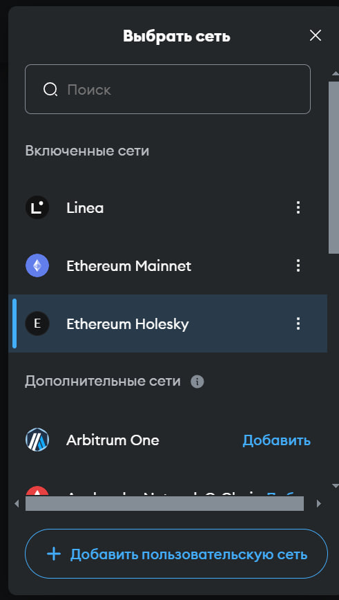
2. Click **"Import tokens"**.  
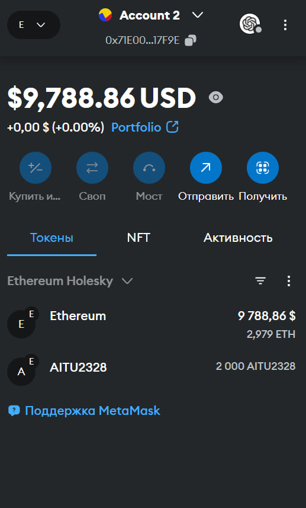
3. Paste the **deployed contract address** into **"Token Contract Address"**. 
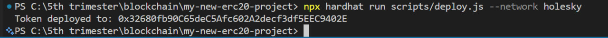 
4. Token Symbol and Decimals should auto-populate if everything is correct.  
5. Confirm to see your token balance (2000 tokens initially).

### Transferring Tokens

You can transfer tokens in **two ways**:

1. **Through MetaMask**:  
   - Select your newly imported token, click "Send", choose a recipient address, and confirm the transaction.  
   - Wait for confirmation.  

2. **Through Hardhat console**:
   ```bash
   npx hardhat console --network holesky
   ```
   ```js
   const [owner] = await ethers.getSigners();
   const contractAddr = "0x32680fb90C65deC5Afc602A2decf3df5EEC9402E";
   const Token = await ethers.getContractFactory("AstanaITUniversity_se2328");
   const token = await Token.attach(contractAddr);

   const receiver = "0xb88dB31A826a8f07947503c7Ff0c4dADe45463a9";
   const amount = ethers.parseUnits("10", 18);

   const tx = await token.transfer(receiver, amount);
   await tx.wait();
   console.log("Sent 10 AITU2328 tokens to:", receiver);
   ```

### Querying Contract Functions

Our contract tracks transaction info in a `mapping(bytes32 => TransferInfo)`. We can fetch the sender, receiver, amount, and timestamp. For example, if you want to retrieve info about the last transfer:

1. Compute the same hash as in the contract:
   ```js
   const receipt = await ethers.provider.getTransactionReceipt(tx.hash);
   const block = await ethers.provider.getBlock(receipt.blockNumber);
   const blockNumber = receipt.blockNumber;
   const blockTimestamp = block.timestamp;
   const { solidityKeccak256 } = ethers.utils;

   const pseudoHash = solidityKeccak256(
     ["address","address","uint256","uint256","uint256"],
     [
       owner.address,
       receiver,
       amount, // 10 * 10^18
       blockTimestamp,
       blockNumber
     ]
   );
   console.log("pseudoHash:", pseudoHash);
   ```
2. Call contract methods:
   ```js
   const sender = await token.getSender(pseudoHash);
   const receiverAddr = await token.getReceiver(pseudoHash);
   const info = await token.getTransactionInfo(pseudoHash);
   const humanTime = await token.getLatestBlockTimestampHumanReadable(pseudoHash);

   console.log("Sender:", sender);
   console.log("Receiver:", receiverAddr);
   console.log("Transaction Info:", info); // (sender, receiver, amount, timestamp)
   console.log("Timestamp (string):", humanTime);
   ```

Use these results (and console output) in your screenshots to prove the contract meets the requirements for retrieving transaction details.

---

## Screenshots / Demo

Below are suggested screenshots to add in this section of your README:

1. **Compilation Success**: Output from `npx hardhat compile`.  
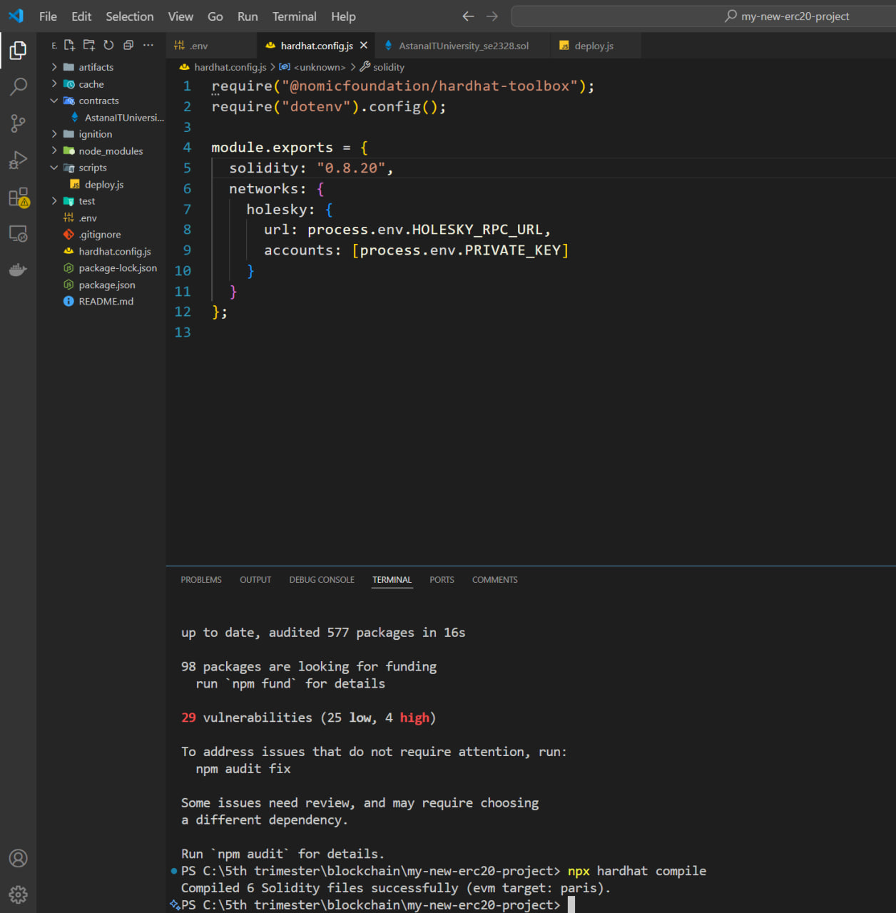
2. **Deployment**: Terminal showing `Token deployed to: 0x...`.  

3. **MetaMask Import**: Screenshot of MetaMask after adding the custom token, showing 2000 tokens.
  
4. **Transfer**:  
   - Through MetaMask (send screen and confirmation). 
   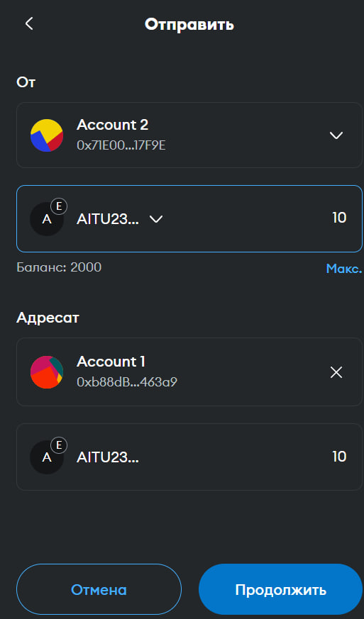 
   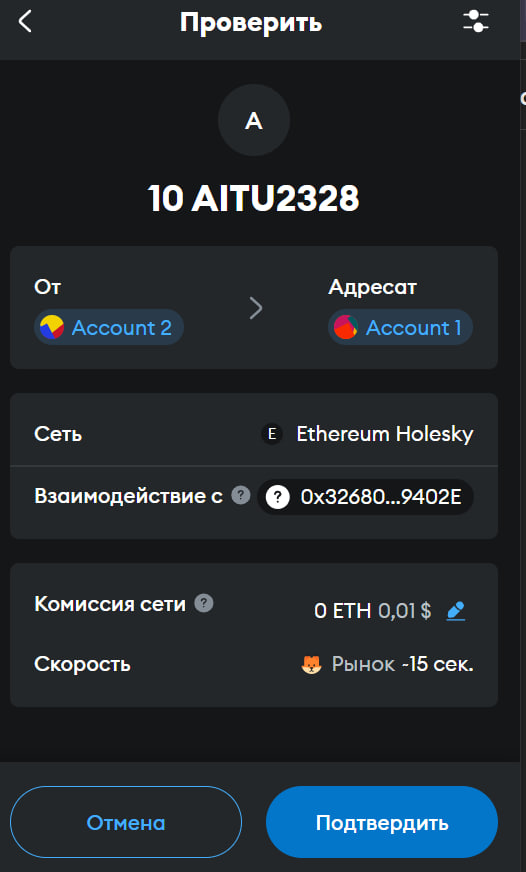
   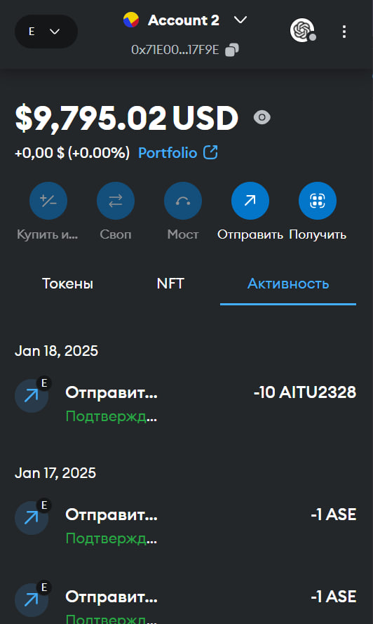
   - Terminal logs / Etherscan link if desired.  
   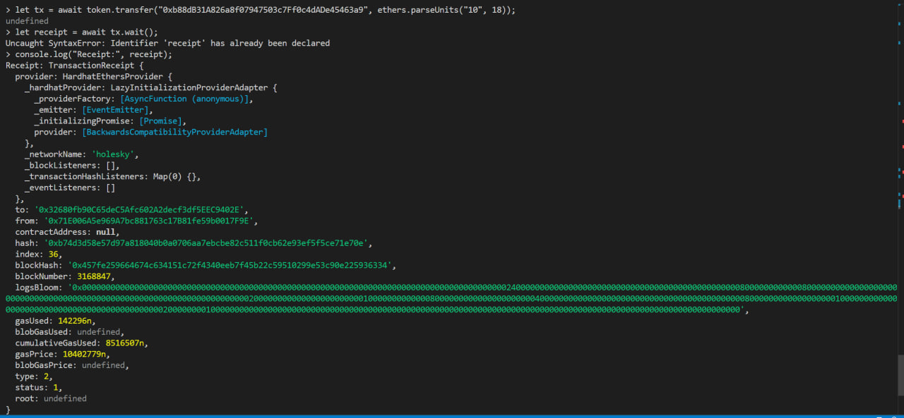
5. **Hardhat Console**:  
   - Checking `balanceOf`, `totalSupply`.  
   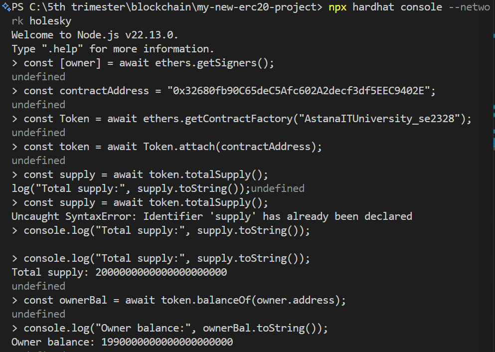
   - Retrieving transaction info (`getTransactionInfo`, etc.) with `pseudoHash`. 
   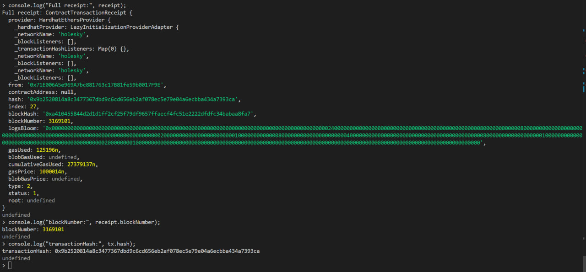 
   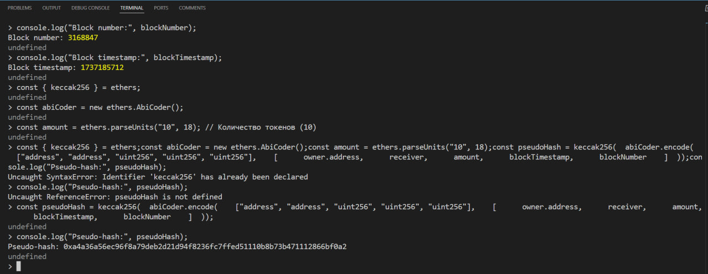
   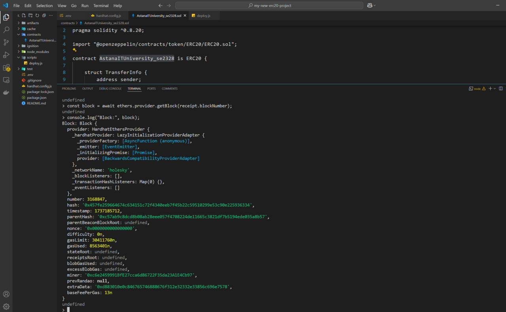
   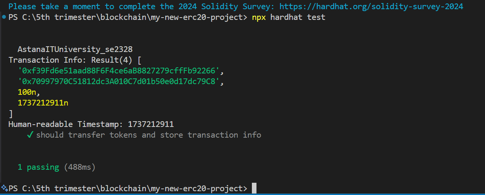


---

## License

This project is licensed under the [MIT License](LICENSE).  

You may use and modify this code freely for educational or commercial purposes under the terms of the MIT license.
